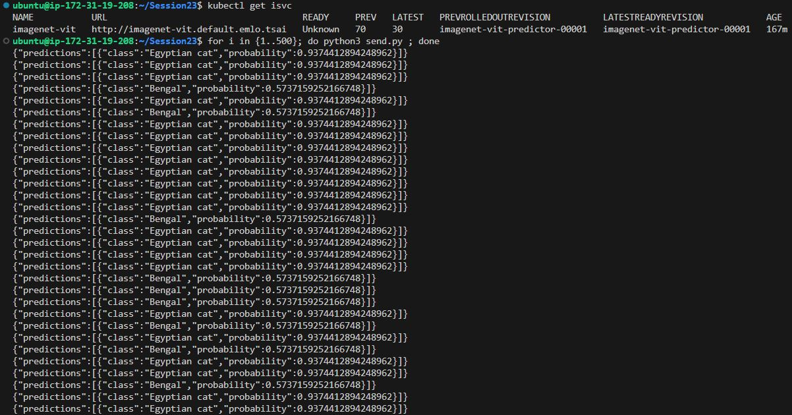
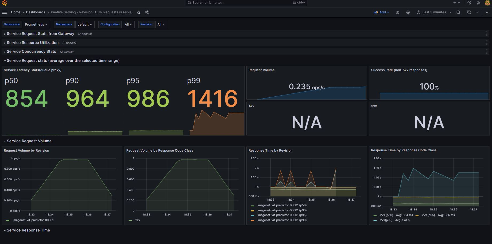
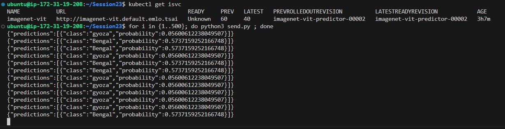
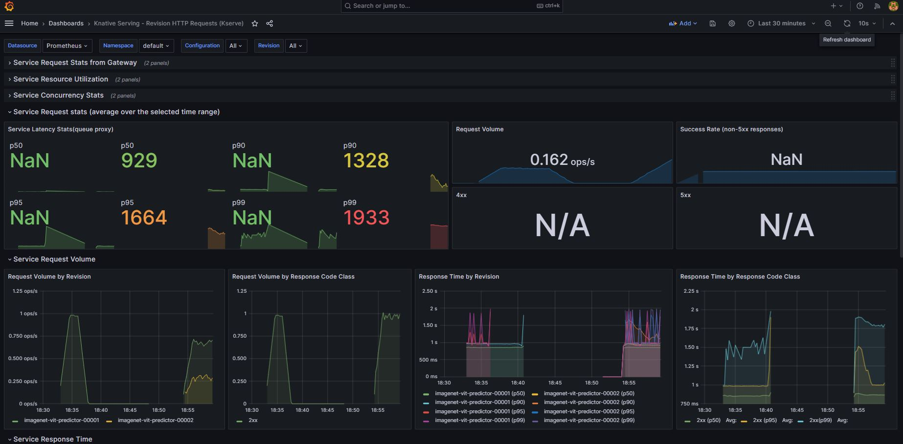
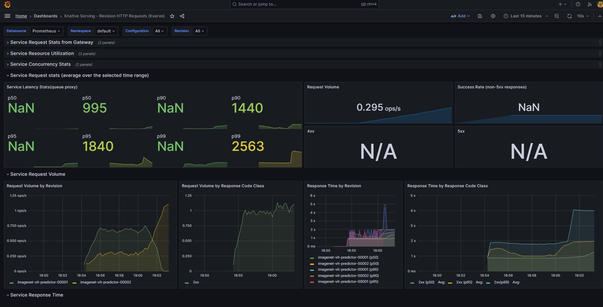
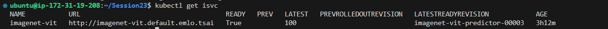
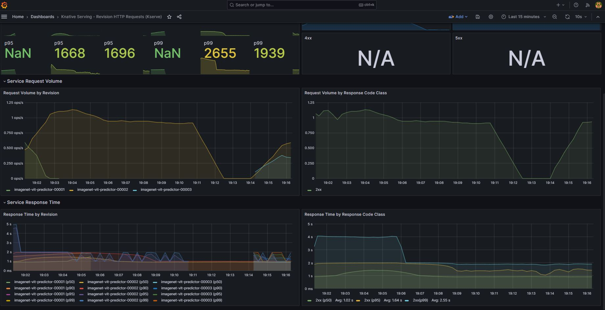
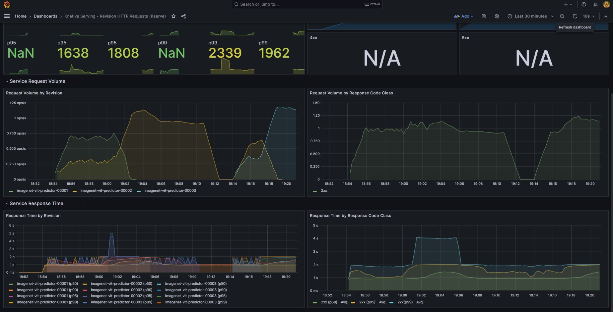

# Canary Deployment, Monitoring & ArgoCD

- Canary rollouts in Kubernetes are supported by KServe for inference services.
- Enables deploying a new version of an InferenceService to receive a percentage of traffic.


![fastapi[all]](https://img.shields.io/badge/fastapi[all]-0.98.0-green)


## Objective 

- Deploy any 3 models (has to be imagenet classifiers) from huggingface
Create a Repository with all the code, and deployment files, and argo app yaml files
- Use ArgoCD to connect your repo for automated deployment
You will perform the below deployment step and run [send.py](<http://send.py>) to add load to the model
- Perform Deployment Steps
- 1st model with 1 replica
- 2nd model with 30% traffic (canary candidate)
- 2nd model with 100% traffic (promoted to production)
- 2nd model with 2 replicas
- 3rd model with 30% traffic (canary candidate)
- 3rd model with 100% traffic
- During the deployments, make sure to use Grafana to see Traffic Metrics
Take screenshots during Canary Deployment of each step in deployment Service Latency Service Request Volume Response Time by Revision

## Inference Model 

Following image classifications models have been downloaded from hugging face

1. https://huggingface.co/apple/mobilevitv2-1.0-imagenet1k-256
2. https://huggingface.co/nateraw/food
3. https://huggingface.co/dima806/67_cat_breeds_image_detection

Create a t3a.2xlarge instance with Ubuntu Base Image

## Create the Cluster
```
eksctl create cluster -f eks-config.yaml
```

## Install KServe with KNative and ISTIO
```
kubectl apply -f https://github.com/kubernetes-sigs/metrics-server/releases/latest/download/components.yaml

kubectl apply -f https://github.com/knative/serving/releases/download/knative-v1.11.0/serving-crds.yaml

kubectl apply -f https://github.com/knative/serving/releases/download/knative-v1.11.0/serving-core.yaml

kubectl apply -l knative.dev/crd-install=true -f https://github.com/knative/net-istio/releases/download/knative-v1.11.0/istio.yaml

kubectl apply -f https://github.com/knative/net-istio/releases/download/knative-v1.11.0/istio.yaml

kubectl apply -f https://github.com/knative/net-istio/releases/download/knative-v1.11.0/net-istio.yaml

# For this patch command, you might need bash to run it
kubectl patch configmap/config-domain \
      --namespace knative-serving \
      --type merge \
      --patch '{"data":{"emlo.tsai":""}}'

kubectl apply -f https://github.com/knative/serving/releases/download/knative-v1.11.0/serving-hpa.yaml

kubectl apply -f https://github.com/cert-manager/cert-manager/releases/download/v1.13.2/cert-manager.yaml
```

Wait for cert manager pods to be ready, check using `kubectl get pods -A`:
```
kubectl apply -f https://github.com/kserve/kserve/releases/download/v0.11.2/kserve.yaml
```

Wait for KServe Controller Manager to be ready, check using `kubectl get pods -A`:
```
kubectl apply -f https://github.com/kserve/kserve/releases/download/v0.11.2/kserve-runtimes.yaml
```

Check all created Custom Resource Definitions (CRDs): `kubectl get crd`


<!-- ## Create the Storage Controller
```
k apply -f sc.yaml
``` -->

## Create S3 Service Account
Change AWS_ACCESS_KEY_ID and AWS_SECRET_ACCESS_KEY with your account keys.
```
kubectl apply -f s3.yaml
```

## Download the models
Download any three imagenet classifier models from huggingface, make their mar files and push all mar to s3 bucket.

Create mar files of all models:
```
python download_all.py
python create_mar.py
```

Create an aws s3 bucket and push the mar files:
```
aws s3 cp --recursive model-store s3://emlo-session23/
```

## Deploy and Test the first model
Deploy imagenet-vit model:
```
kubectl apply -f vit-classifier.yaml
```

To test a model, change url and Host in send.py file. Copy-paste a base64 image inside input.json. Run below code:
```
python send.py
```

## Metrics Monitoring using Prometheus & Grafana
Install Kustomize on your system by downloading precompiled binaries.
```
curl -s "https://raw.githubusercontent.com/kubernetes-sigs/kustomize/master/hack/install_kustomize.sh"  | bash
```

### Install Prometheus
```
git clone https://github.com/kserve/kserve
```

```
cd kserve
./kustomize build docs/samples/metrics-and-monitoring/prometheus-operator | kubectl apply -f -
kubectl wait --for condition=established --timeout=120s crd/prometheuses.monitoring.coreos.com
kubectl wait --for condition=established --timeout=120s crd/servicemonitors.monitoring.coreos.com
./kustomize build docs/samples/metrics-and-monitoring/prometheus | kubectl apply -f -
```

Test if Prometheus is working:
```
# ssh -L8080:localhost:8080 ubuntu@65.2.145.92 ## port forwarding 
# localhost:9090
kubectl port-forward service/prometheus-operated -n kfserving-monitoring 9090:9090
```

From the pod , there are two prometheus metrics outputs coming, one of model and another of queue-proxy. As two outputs cannot be handled, so we need to aggregate both outputs. We apply patch:
```
kubectl patch configmaps -n knative-serving config-deployment --patch-file qpext_image_patch.yaml
```

### Install Grafana
```
helm repo add grafana https://grafana.github.io/helm-charts
helm repo update
helm install grafana grafana/grafana
```

Fetch the admin user’s password from secrets:
```
kubectl get secret --namespace default grafana -o jsonpath="{.data.admin-password}" | base64 --decode ; echo
```
### XGWTAwmR4lVJ9Oc8dEL1TpANgmSMrsLTOxUDJPJ0

Port forward Grafana:
```
kubectl port-forward svc/grafana 3000:80
```
Use user as "admin" and password from above command to login to grafana.

Now, add a new data source in Grafana. Use "`http://prometheus-operated.kfserving-monitoring.svc.cluster.local:9090`" as the server url.

Import the dashboard template:
- Go to URL: "`https://grafana.com/grafana/dashboards/18032-knative-serving-revision-http-requests/`" and copy ID by clicking on "Copy ID to clipboard" button.

- Go to grafana, create new dashbaord using Import option.

Send multiple requests to model:
```
for i in {1..200}; do python3 send.py ; done
```



## Second model deployment as v2 of first model
Copy imagenet-vit and cat-classifier model deployment files from s3 to local:
```
aws s3 cp --recursive s3://<bucket_name>/imagenet-vit/ imagenet-vit/
aws s3 cp --recursive s3://<bucket_name>/cat-classifier/ cat-classifier/
```

Make changes as below:
- Inside config.properties of cat-classifier, change the model name in model_snapshot from "cat-classifier" to "vit-classifier".
- Replace model and processor of imagenet-vit with cat-classifier
```
cd imagenet-vit/model-store
mv imagenet-vit.mar imagenet-vit.zip
unzip imagenet-vit.zip

cd cat-classifier/model-store
mv cat-classifier.mar cat-classifier.zip
unzip cat-classifier.zip

cd imagenet-vit/model-store
# delete model, processor
rm -rf model processor
# copy model, processor of cat-classifier here
cp ../../cat-classifier/model-store/model .
cp ../../cat-classifier/model-store/processor .

rm imagenet-vit.zip
```

Now, create mar file and push to s3: 
```
zip -r imagenet-vit.mar *

rm -rf hf_image_classification.py MAR-INF model processor

cd ../../

aws s3 cp --recursive imagenet-vit s3://emlo-session23/food-classifier
```

Now change vit-classifier.yaml to deploy cat-classifier as new version 2 of imagenet-vit model.
```
kubectl apply -f vit-classifier.yaml
``` 

Check for traffic percentage between older and newer version:
```
kubectl get isvc
```

Load the model
```
python send.py
```




To increase/descrease the traffic to newer version, just change percentage against canaryTrafficPercent in classifier yaml file and apply.
Finally, we can promote our new model by just removing canaryTrafficPercent.

## Third model deployment as v3 of second model




